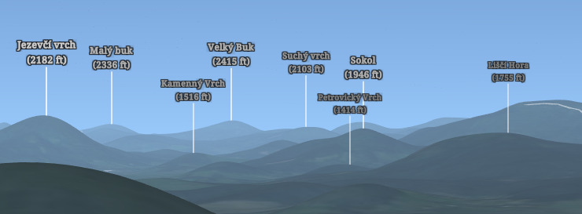
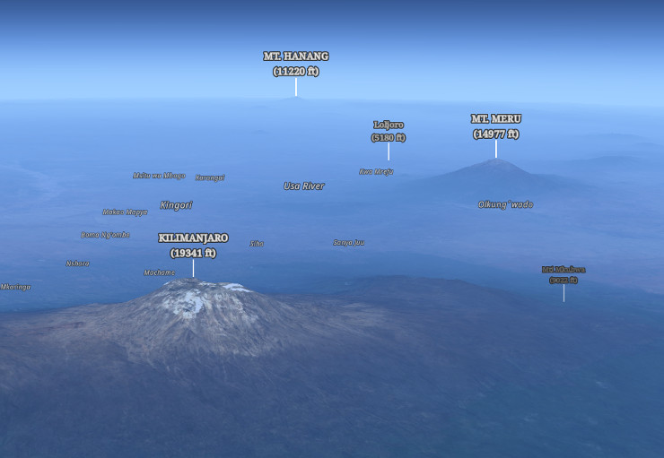

{:class="img-responsive"}

This webpage has been created as a simple demonstration of how a global
interactive 3D map of Earth mountains, adhering to the time-proven rules of
cartographic design, may be built with open-source technology and freely
available data.

[Simply browse the mountain map][1]{:target="_blank"} with a WebGL-enabled browser. 

Alernatively, here is a tour of some interesting locations, which might
serve as your starting point:

* [San Diego County (southern California), looking north-west][3]{:target="_blank"}

* [San Jacinto Peak (southern California), looking south-east][14]{:target="_blank"}

* [Mount Whitney (central California), bird's eye view from north-east][11]{:target="_blank"}

* [The North Cascades (Washington State)][9]{:target="_blank"}

* [Isanotski and Shishaldin volcanoes (Aleutian Islands, Alaska)][13]{:target="_blank"}

* [The viewing platform at Crotched Mountain (New Hampshire)][10]{:target="_blank"}

* [Summit view from Mont Blanc (France/Italy/Switzerland), looking east][15]{:target="_blank"}

* [Matterhorn (Switzerland)][7]{:target="_blank"}

* [The Wetterstein mountain range (Germany/Austria)][5]{:target="_blank"}

* [Loferer und Leoganger Steinberge (Austria)][6]{:target="_blank"}

* [The Alps from the North][8]{:target="_blank"}

* [Krkonoše Mountain Range (Czech Republic/Poland) from the south][18]{:target="_blank"}

* [Mount Narodnaya, Nether-polar Ural mountains (Russia)][12]{:target="_blank"}

* [Nanga Parbat, Gilgit Baltistan (Pakistan)][16]{:target="_blank"}

* [Ngorongoro Highlands (Tanzania), looking west][4]{:target="_blank"}

* [Table Mountain National Park (South Africa)][17]{:target="_blank"}

 

## How Was the Map Created?

The map was built using [vts-geospatial][19]{:target="_blank"}, an
open-source 3D geospatial software stack designed and developed by [Melown
Technologies SE][20]{:target="_blank"}.

The complete source code of this project (and of this website) is [available
in an accompanying GitHub repository][21]{:target="_blank"}, and you are
welcome to play with it and use as inspiration for your own 3D mapping projects. 
Simple instructions on how to recreate the map are available [in the
repository's
README][22]{:target="_blank"}.

 

## The FOSS4G 2019 NA talk

This website has been created to accompany my talk "Visual Hierarchies in 3D
cartography With VTS", first held at FOSS4G-NA 2019 in San Diego in April 2019. 

In the talk, the map is created from scratch in a simple tutorial. Links to the
configuration files and styles used in the tutorial are given below for a
clear reference.

The view overlooking Mount Rainier to the north is used to demonstrate the
state of the map after every step.

#### Step 1 - The Basemap

**Code**: 

 * [new storage view definition][28]{:target="_blank"}

[State of the map after this step][23]{:target="_blank"}. 
    
#### Step 2 - The Ultra-prominent Peaks

**Code**: 

 * [new geodata free layer in vts-mapproxy][29]{:target="_blank"}
 * [free layer stylesheet][30]{:target="_blank"}
 * [updated storage view with the new free layer][31]{:target="_blank"}

[State of the map after this step][24]{:target="_blank"}.

#### Step 3 - Mountains and Settlements from OSM

**Code**: 

 * [new free layer stylesheet][32]{:target="_blank"}
 * [updated storage view with the new free layer][33]{:target="_blank"}

[State of the map after this step][25]{:target="_blank"}.

#### Step 4 - The Intellectual Hierarchy

**Code**: 

 * [updated storage view][34]{:target="_blank"}
 * [updated osm free layer stylesheet][35]{:target="_blank"}
 * [updated ultra-prominent-peaks stylesheet][36]{:target="_blank"}

[State of the map after this step][26]{:target="_blank:}.

#### Step 5 - The Visual Hierarchy

**Code**: 

 * [updated storage view][37]{:target="_blank"}
 * [updated osm free layer stylesheet][38]{:target="_blank"}
 * [updated ultra-prominent-peaks stylesheet][39]{:target="_blank"}

[State of the map after this step][27]{:target="_blank"}.

 

## Desktop Version of the Map

{:class="img-responsive"}

You might also want to consider taking a look at the mountain map in
[vts-browser-cpp desktop][2]{:target="_blank"}.  Though the whitewash and
vertical-exaggeration techniques used in the mountain map are not yet fully
reflected in the current version of vts-browser-cpp, the realistic physical
atmosphere and enhanced navigation capabilities provide for a beautiful,
almost Zen-like experience.

 

## Legal Notice

Though all of the sources used in this map are freely available, license
restrictions do apply.  Check with the respective copyright holders, clearly
marked in the bottom-right area of your map window:

![Credits section in vts-browser-js][40]

You are free to use the information contained herein or in the accompanying
GitHub repo map as a basis for your own 3D-mapping projects.   

VTS Geospatial is &copy; Melown Technologies SE 2015-19 

[1]: https://rigel.mlwn.se/store/a-3d-mountain-map/map-config/map
[2]: https://github.com/melowntech/vts-browser-cpp
[3]: https://rigel.mlwn.se/store/a-3d-mountain-map/map-config/map/?pos=obj,-117.150264,32.638531,fix,-23.13,-316.06,-14.07,0.00,18379.80,45.00
[4]: https://rigel.mlwn.se/store/a-3d-mountain-map/map-config/map/?pos=obj,35.651614,-3.231357,fix,1890.99,-266.45,-20.74,0.00,61778.30,45.00
[5]: https://rigel.mlwn.se/store/a-3d-mountain-map/map-config/map/?pos=obj,11.089189,47.412804,fix,1744.54,-151.48,-18.03,0.00,14002.15,30.00
[6]: https://rigel.mlwn.se/store/a-3d-mountain-map/map-config/map/?pos=obj,12.660472,47.538069,fix,1562.45,-169.85,-49.46,0.00,14837.81,45.00
[7]: https://rigel.mlwn.se/store/a-3d-mountain-map/map-config/map/?pos=obj,7.658566,45.976451,fix,3351.14,-121.61,-11.37,0.00,6569.63,45.00
[8]: https://rigel.mlwn.se/store/a-3d-mountain-map/map-config/map/?pos=obj,9.741529,46.375075,fix,1656.35,162.52,-11.51,0.00,376412.97,45.00
[9]: https://rigel.mlwn.se/store/a-3d-mountain-map/map-config/map/?pos=obj,-121.281926,48.698838,fix,929.49,-164.09,-16.84,0.00,24990.72,45.00
[10]: https://rigel.mlwn.se/store/a-3d-mountain-map/map-config/map/?pos=obj,-71.881911,42.998033,fix,448.05,-108.77,-15.28,0.00,1659.18,45.00
[11]: https://rigel.mlwn.se/store/a-3d-mountain-map/map-config/map/?pos=obj,-118.290146,36.565113,fix,3285.46,-133.40,-25.09,0.00,33347.92,45.00
[12]: https://rigel.mlwn.se/store/a-3d-mountain-map/map-config/map/?pos=obj,60.186279,65.015886,fix,1113.67,-38.53,-24.29,0.00,18695.90,45.00
[13]: https://rigel.mlwn.se/store/a-3d-mountain-map/map-config/map/?pos=obj,-163.780048,54.779658,fix,543.82,-113.39,-22.98,0.00,28491.67,55.00
[14]: https://rigel.mlwn.se/store/a-3d-mountain-map/map-config/map/?pos=obj,-116.685494,33.814871,fix,3032.20,-143.62,-22.57,0.00,28164.69,45.00
[15]: https://rigel.mlwn.se/store/a-3d-mountain-map/map-config/map/?pos=obj,6.864492,45.832796,fix,4932.53,57.99,-9.52,0.00,624.62,30.00
[16]: https://rigel.mlwn.se/store/map-config/visual-hierarchies1/?pos=obj,74.611231,35.213436,fix,4823.86,-19.87,-8.59,0.00,17007.26,75.00
[17]: https://rigel.mlwn.se/store/map-config/visual-hierarchies1/?pos=obj,18.363182,-34.018678,fix,221.15,25.33,-44.46,0.00,14549.58,75.00
[18]: https://rigel.mlwn.se/store/map-config/visual-hierarchies1/?pos=obj,15.560333,50.620320,fix,590.24,14.44,-16.56,0.00,8637.47,75.00
[19]: https://vtsdocs.melown.com/
[20]: https://www.melown.com/
[21]: https://github.com/ondra-prochazka/a-3d-mountain-map
[22]: https://github.com/ondra-prochazka/a-3d-mountain-map/blob/master/README.md
[23]: https://rigel.mlwn.se/store/a-3d-mountain-map/map-config/map-step1/?pos=obj,-121.965107,47.040840,fix,761.16,-24.23,-7.90,0.00,33793.24,45.00
[24]: https://rigel.mlwn.se/store/a-3d-mountain-map/map-config/map-step2/?pos=obj,-121.965107,47.040840,fix,761.16,-24.23,-7.90,0.00,33793.24,45.00
[25]: https://rigel.mlwn.se/store/a-3d-mountain-map/map-config/map-step3/?pos=obj,-121.965107,47.040840,fix,761.16,-24.23,-7.90,0.00,33793.24,45.00
[26]: https://rigel.mlwn.se/store/a-3d-mountain-map/map-config/map-step4/?pos=obj,-121.965107,47.040840,fix,761.16,-24.23,-7.90,0.00,33793.24,45.00
[27]: https://rigel.mlwn.se/store/a-3d-mountain-map/map-config/map-step5/?pos=obj,-121.965107,47.040840,fix,761.16,-24.23,-7.90,0.00,33793.24,45.00
[28]: https://raw.githubusercontent.com/ondra-prochazka/a-3d-mountain-map/master/var_vts_store_a-3d-mountain-map_map-config/map-step1
[29]: https://raw.githubusercontent.com/ondra-prochazka/a-3d-mountain-map/master/etc_vts_mapproxy_a-3d-mountain-map_d/peaklist-org-ultras.json
[30]: https://raw.githubusercontent.com/ondra-prochazka/a-3d-mountain-map/master/var_vts_store_a-3d-mountain-map_stylesheet/map-peaklist-org-ultras-step2.style
[31]: https://raw.githubusercontent.com/ondra-prochazka/a-3d-mountain-map/master/var_vts_store_a-3d-mountain-map_map-config/map-step2 
[32]: https://raw.githubusercontent.com/ondra-prochazka/a-3d-mountain-map/master/var_vts_store_a-3d-mountain-map_stylesheet/map-osm-maptiler-step3.style
[33]: https://raw.githubusercontent.com/ondra-prochazka/a-3d-mountain-map/master/var_vts_store_a-3d-mountain-map_map-config/map-step3
[34]: https://raw.githubusercontent.com/ondra-prochazka/a-3d-mountain-map/master/var_vts_store_a-3d-mountain-map_map-config/map-step4
[35]: https://raw.githubusercontent.com/ondra-prochazka/a-3d-mountain-map/master/var_vts_store_a-3d-mountain-map_stylesheet/map-osm-maptiler-step4.style
[36]: https://raw.githubusercontent.com/ondra-prochazka/a-3d-mountain-map/master/var_vts_store_a-3d-mountain-map_stylesheet/map-peaklist-org-ultras-step4.style
[37]: https://raw.githubusercontent.com/ondra-prochazka/a-3d-mountain-map/master/var_vts_store_a-3d-mountain-map_map-config/map-step5
[38]: https://raw.githubusercontent.com/ondra-prochazka/a-3d-mountain-map/master/var_vts_store_a-3d-mountain-map_stylesheet/map-osm-maptiler-step5.style
[39]: https://raw.githubusercontent.com/ondra-prochazka/a-3d-mountain-map/master/var_vts_store_a-3d-mountain-map_stylesheet/map-peaklist-org-ultras-step5.style
[40]: https://github.com/ondra-prochazka/a-3d-mountain-map/raw/master/media/credits.png
